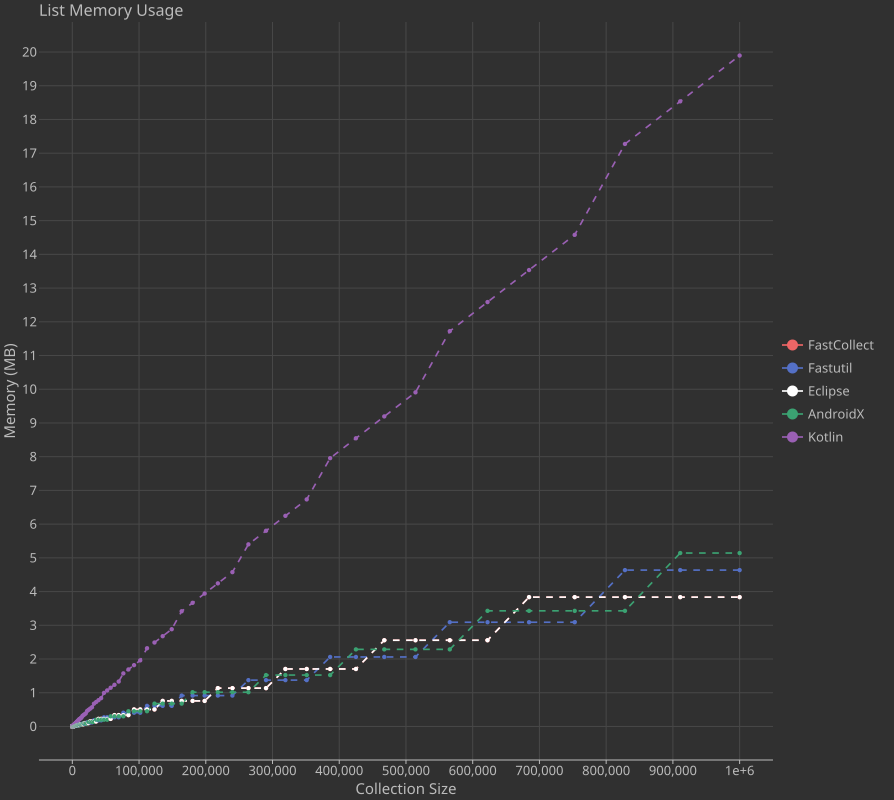
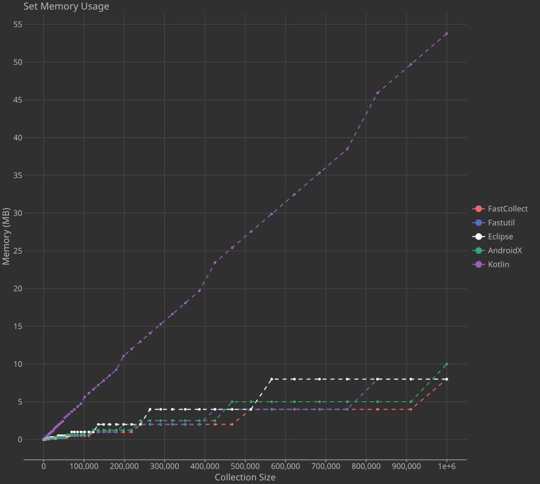
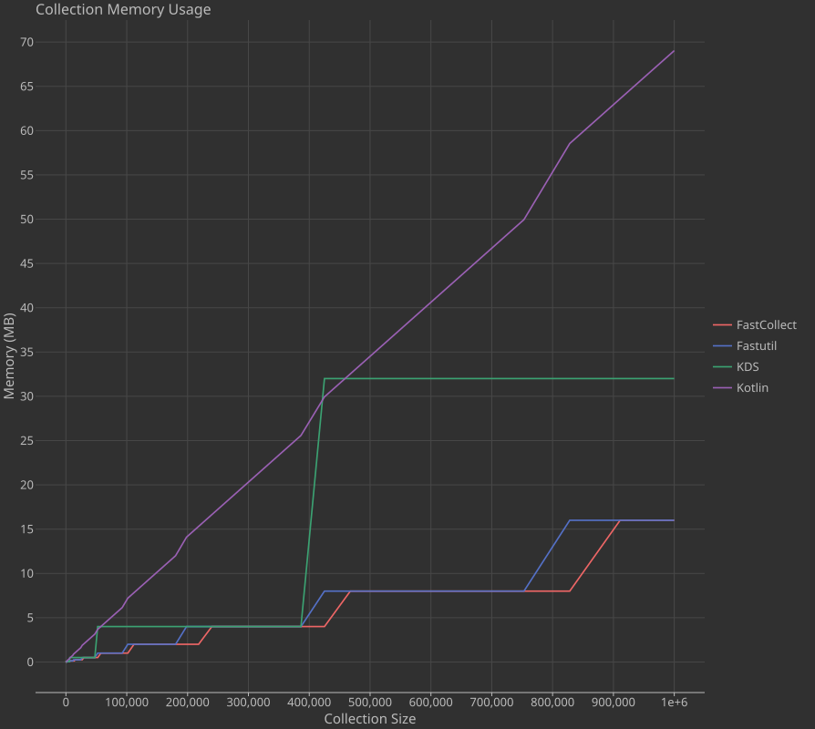
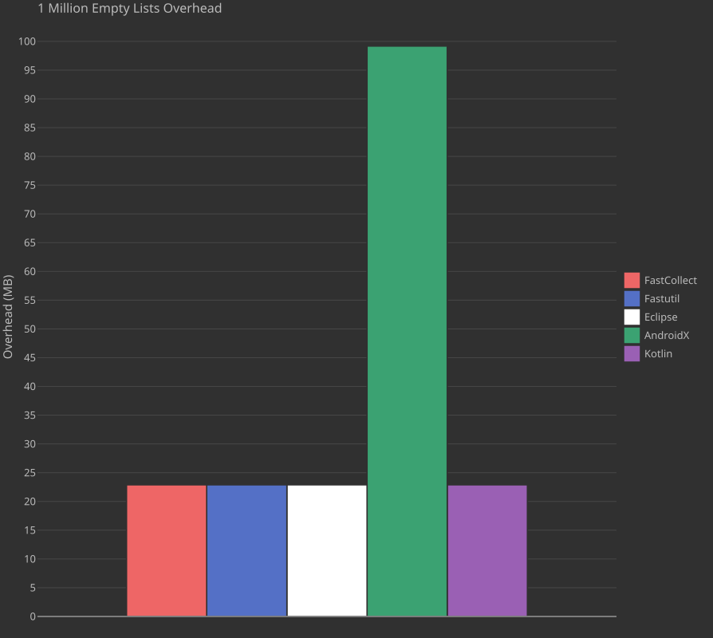
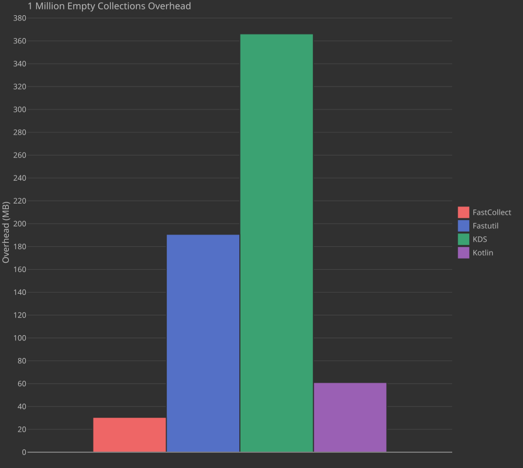
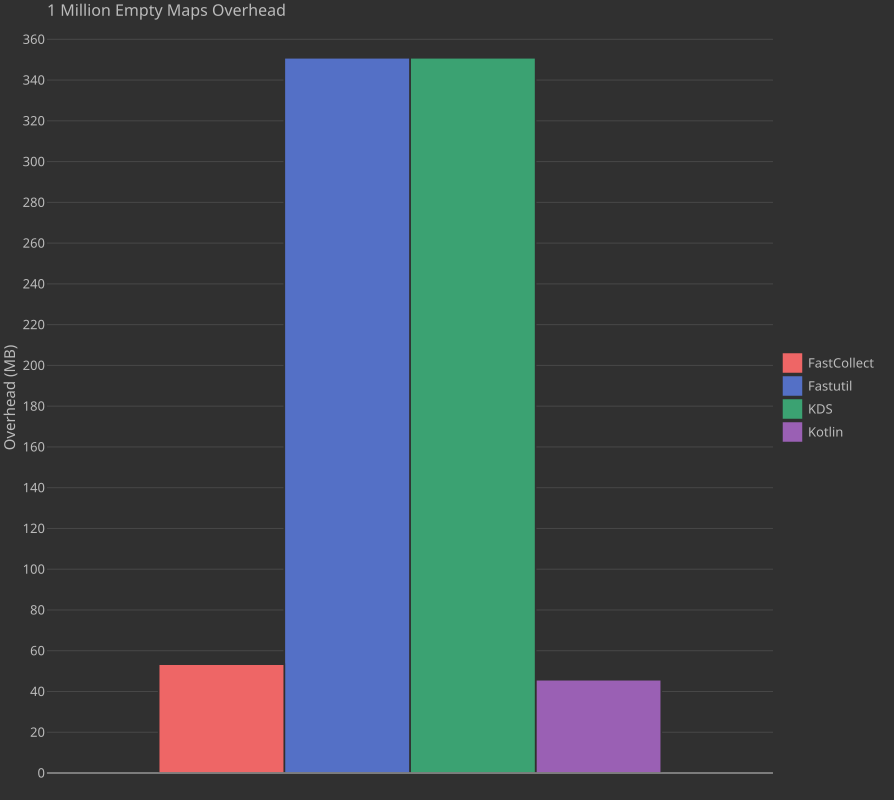
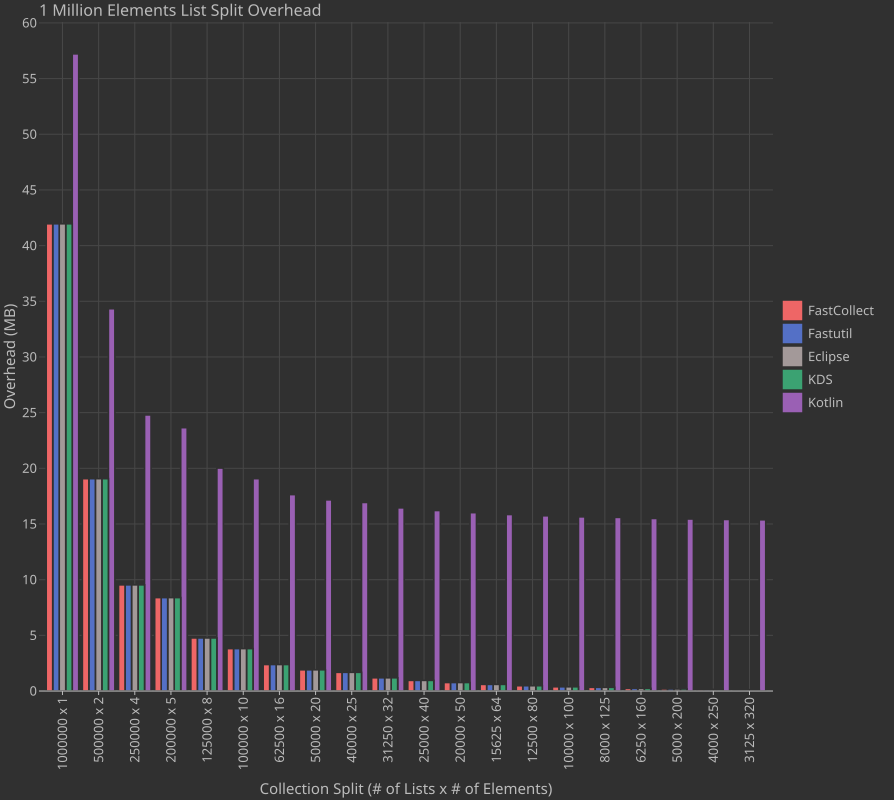
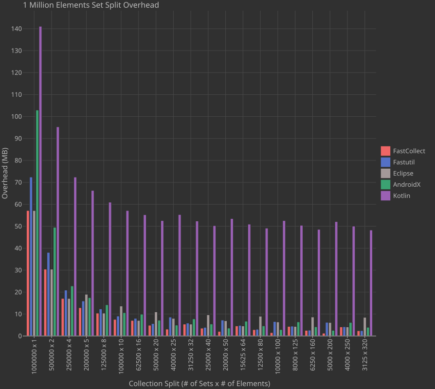
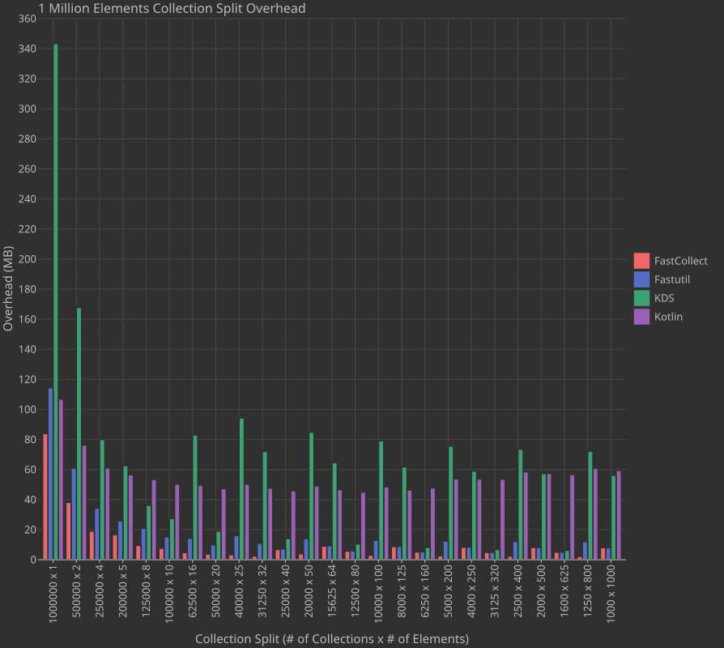

# Memory Benchmarks #

All memory benchmarks were only run on JVM, where usage was captured with the JOL (Java Object Layout) library for Int
collections (IntList, IntSet, Int2IntMap and equivalents). Since the benchmarks are run on JVM, this allows us to
compare with [fastutils](https://github.com/vigna/fastutil) as well (the standard in primitive collections), though
fastutils is not available on other platforms.

## Memory Usage ##

Our first benchmarks track how object size grows as the number of elements in a collection increases. From the graphs
below it is apparent that FastCollect is vastly more memory efficient than standard Kotlin collections, still a decent
amount more memory efficient than [KDS](https://docs.korge.org/data-structures/), and has general parity with fastutils.

These results are not terribly surprising (except perhaps that KDS uses more memory than it strictly speaking should),
given that the Kotlin collections store boxed primitives and FastCollect stores raw primitives.

### List ###

### Set ###

### Map ###

## Empty Collection Memory Usage ##

An often overlooked axis in memory benchmarking is testing the overhead of empty collections. Empty (or small sized)
collections can be very common in many programming scenarios. An 'ideal' empty collection would use no memory since it
has nothing to store. Obviously we can't store anything with zero overhead in reality, so here we compare the memory
usage of 1,000,000 empty collections.

The results show that FastCollect consistently matches Kotlin collections for low overhead. Fastutil and KDS are
surprisingly bad for Sets and Maps (indeed one of the impetuses for this project was that fastutil wasted enough space
for empty / small collections that programs were running out of memory for reasonably sized data sets).

### List ###

### Set ###

### Map ###

## Collection Splits Memory Usage ##

Continuing down this rabbit hole of extra overhead, we now compare the amount of overhead required to store 1,000,000
Ints in a variety of ways, i.e., 1,000,000 collections of 1 Int, 500,000 collections of 2 Ints, etc... The theoretical
minimum space required (4 * 1,000,000 = 4,000,000 bytes) is subtracted from the actual space used to obtain the overhead
displayed below.

As expected from the empty collection results, everyone except Kotlin collections has lower overhead for lists (since
Kotlin collections store boxed values). For sets and maps KDS has a very high overhead, sometimes more than Kotlin
collections even though it is supposedly storing primitives... FastCollect has the lowest overhead, followed by
fastutils (this is due to the fact that FastCollect sets/maps use Robin Hood hashing, which allows for a higher load
factor than fastutils uses by default).

### List ###

### Set ###

### Map ###

